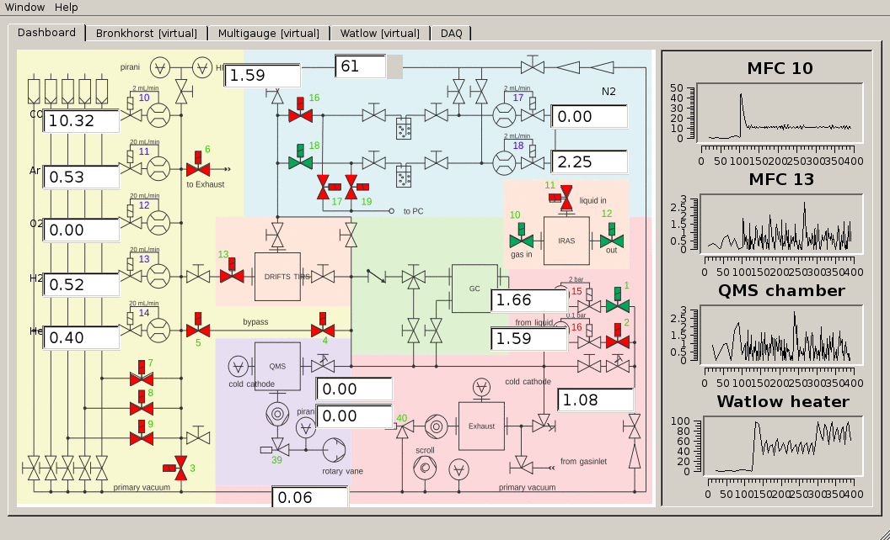

===================================
Welcome to pyhard2's documentation!
===================================

pyhard2 is the free device-driver development toolkit (DDK) written in
Python.

It provides an alternative to other DDKs like LabVIEW, the Windows Driver Kit,
and Matlab on the desktop and in the lab.  It is the free software choice for
free hardware projects on Arduino/Raspberry Pi/BeagleBone hardware.

- Written entirely in Python, pyhard2 is completely free and open source.
- Runs on any platform Python supports (including, but not limited to, MS
  Windows, Mac OS X, Linux and the BSDs).
- SCPI drivers are supported.
- New drivers should take about 0.5 to 1 day to write and do not require a large
  amount of code.
- Graphical user interfaces are loosely coupled to the driver.
- Creating the GUI from Qt Designer (ui-files) is supported.
- The library takes care of threading when the driver is used in a GUI.
- Easily create a Dashboard presenting a live overview over every running
  controller.

Example
=======

The following shows what pyhard2's Dashboard looks like.

And an interactive session using a pyhard2 driver may look like the following:

>>> import pyhard2.driver as drv
>>> import pyhard2.driver.fluke as fluke
>>> ser = drv.Serial("COM1")
>>> multimeter = fluke.Fluke18x(ser)
>>> multimeter.measure.read()
26.1
>>> multimeter.unit.read()
"Deg C"
>>> multimeter.press_button_blue.write()
>>> multimeter.measure.read()
69.1
>>> multimeter.unit.read()
"Deg F"

Tutorials
=========

.. toctree::
   :maxdepth: 1

   tut1

API documentation
=================

.. toctree::
   :maxdepth: 1

   apidrv
   apigui
   apictrlr
   apimisc

Drivers and controllers
=======================

.. toctree::
   :maxdepth: 2

   drv
   ctrlr

License
=======

GNU GENERAL LICENSE v3.0
------------------------

pyhard2 - An object-oriented framework for the development of instrument
drivers.
Copyright (C) 2012-2014, Mathias Laurin

This program is free software: you can redistribute it and/or modify it under
the terms of the GNU General Public License as published by the Free Software
Foundation, either version 3 of the License, or (at your option) any later
version.

This program is distributed in the hope that it will be useful, but WITHOUT ANY
WARRANTY; without even the implied warranty of MERCHANTABILITY or FITNESS FOR A
PARTICULAR PURPOSE.  See the GNU General Public License for more details.

You should have received a copy of the GNU General Public License along with
this program.  If not, see <http://www.gnu.org/licenses/>.

Installation
============

The project is hosted on `github <https://github.com/Synss/pyhard2>`__ and
`sourceforge <http://pyhard2.sourceforge.net>`_.  Follow the sourceforge link
for the HTML documentation.

To install, either download the archive from the `project page on sourceforge
<https://sourceforge.net/projects/pyhard2>`_ and unpack it in an empty directory
or clone the git repository from github

   git clone https://github.com/Synss/pyhard2.git

Then, in the project root, run::

   python setup.py install

pyhard2 depends on

- pyserial_: Multiplatform Serial Port Module for Python (Win32, Jython, Linux,
  BSD and more).
- PyQt4_: version 4.8 or higher.
- PyQwt5_: current version is 5.2.

.. _pyserial: http://pyserial.sourceforge.net
.. _PyQt4: http://www.riverbankcomputing.com/software/pyqt/download
.. _PyQwt5: http://pyqwt.sourceforge.net

and optionally on

- numpy_ and scipy_: Scientific computing tools for Python
  (used in the module :mod:`pyhard2.driver.daq`).
- matplotlib_: Python plotting.
- pyyaml_: YAML implementations for Python (recommended).
- comedi_: Linux control and measurement device interface (used on Linux,
  in the module :mod:`pyhard2.driver.daq`), or
- pylibnidaqmx_: a Python wrapper to libnidaqmx library (used on Windows
  :mod:`pyhard2.driver.daq`).
- construct_: a powerful declarative parser and builder for binary data (used
  in the module :mod:`pyhard2.driver.bronkhorst`).

.. _numpy: http://www.numpy.org
.. _scipy: http://www.scipy.org
.. _matplotlib: http://matplotlib.org/
.. _pyyaml: http://pyyaml.org/wiki/PyYAMLDocumentation
.. _ezodf: http://pythonhosted.org/ezodf/
.. _comedi: http://www.comedi.org
.. _pylibnidaqmx: http://code.google.com/p/pylibnidaqmx
.. _construct: http://construct.readthedocs.org/en/latest

Development and contributing
============================

Please file issues on `github <https://github.com/Synss/pyhard2/issues>`__.
Questions may be asked on the `mailing list
<https://sourceforge.net/p/pyhard2/mailman/>`_.

Any feedback provided via these channels is very welcome.

Indices and tables
==================

* :ref:`modindex`
* :ref:`search`

