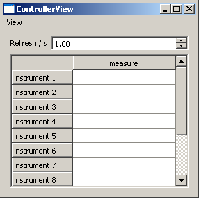
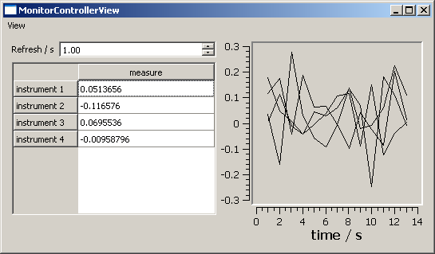
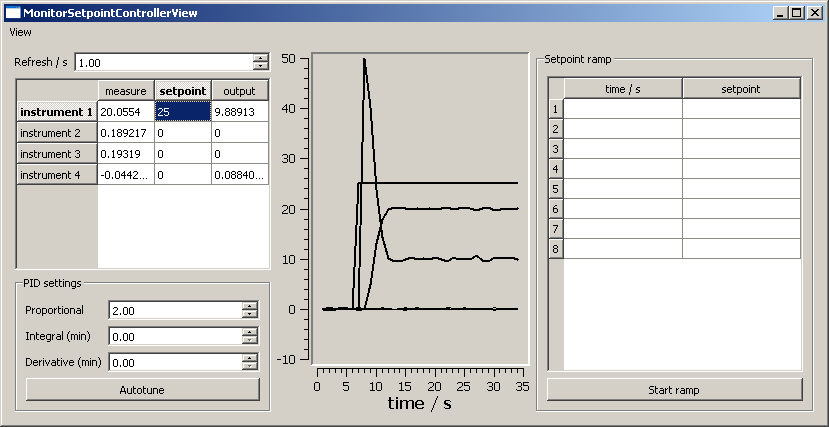

.. module:: pyhard2.ctrlr.qt4

GUI Tutorial 0: Graphical user interfaces
=========================================

The graphical user interfaces in pyhard2 are built on PyQt4.  The module
:mod:`pyhard2.ctrlr.qt4` provides generic controllers with different features.

The :class:`Controller` controller is the simplest and displays a simple
table as shown

The :class:`MonitorController` adds a monitor to the `Controller`
controller.

The :class:`MonitorSetpointController` controller also contains a PID
controller and a table to ramp the setpoint.

.. note::

   The table is really where the communication with the hardware happens.  The
   most common configuration has one hardware instrument per row and one
   parameter or action per column.  It is then possible to poll certain
   parameters by connecting the refresh rate timer to the proper cell.  The
   rest of the GUI is then connected to the table and not to the hardware.  The
   curves shown on the GUI with a monitor, for example, are also stored in the
   table and they are always connected to the refresh rate.  But as they read
   their values from the table, updating them never triggers any reading to the
   hardware.  This architecture ensures that the hardware is called a minimum
   number of times.

